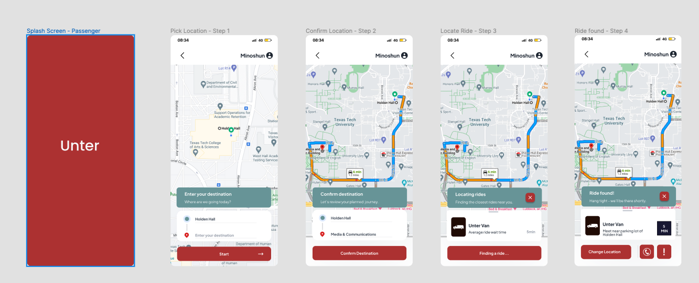
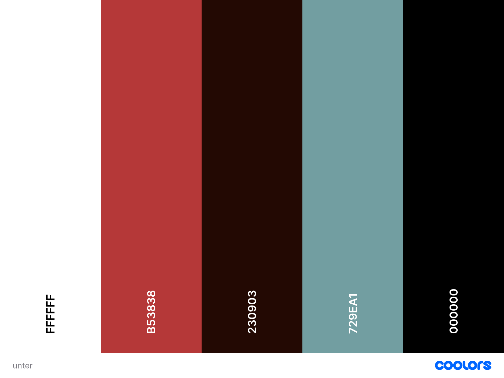
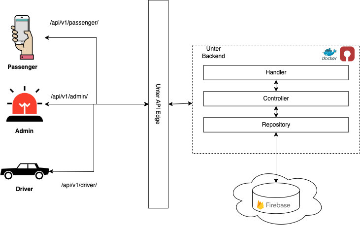
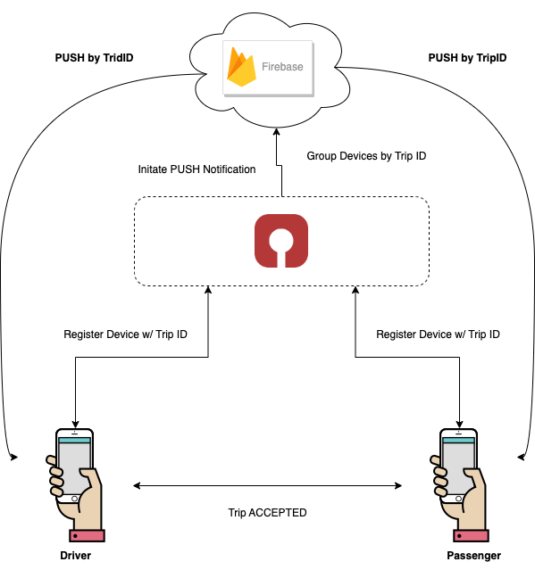
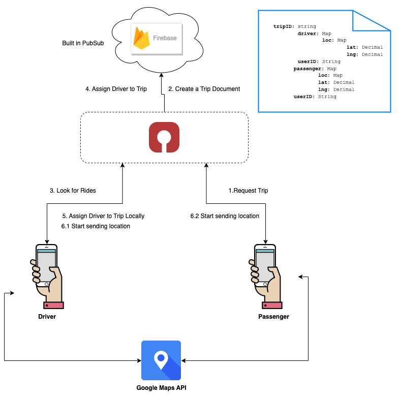

# Unter Mobile App 

## Motivation 
Unter is a rideshare mobile application hoping to improve upon the current TTU rideshare solution. We have key differences between TapRide/Raider Ride. As compared to TapRide we hope to improve in areas such as real-time notifications when a driver arrives, better communication between Drivers and Passengers, sharing precise locations, and improving the campus map. The goal of this application is to replace TapRide and have an application that is easily maintainable by students / Texas Tech. 

We hope to provide a service that caters to three users: Passengers, Drivers, and Admins. Passengers/Students will be able to request a ride by providing their current address and their destination address. Drivers will be able to accept these trips and give ample communication to passengers. Admin will be able to monitor and manipulate the state of trips and users.


|  | 
|:--:| 
| *Passenger UI* |


## Contribution 

Please read the [contribution guide](contributing.md) to learn more!

## Development Guide


### Color Scheme 
|  | 
|:--:| 
| *Color Scheme* |

### Mobile App Development 
1. Clone and install the required dependencies (like nodejs if you do not have it already installed)
```
git clone git@github.com:ShreyeshArangath/unter_mobile_app.git
cd unter/mobile-app 

yarn install 
    or
npm i
```
2. Install the `Expo Go` app on your mobile device. This will let you connect to the local development environment and remotely build your application 
3. Run `npm run web` using your terminal
4. Scan the QR code using the Expo Go app 
5. Start developing! 

### Backend Development
 
[Backend Development Guide](./backend/README.md)

## Architecture

|  | 
|:--:| 
| *High-Level System Design* |

|  | 
|:--:| 
| *Prototype: Firebase Push Notifications* |


|  | 
|:--:| 
| *Prototype: Real-Time Location Tracking* |


## References 
Icon by <a href="https://freeicons.io/profile/6200">Soni Sokell</a> on <a href="https://freeicons.io">freeicons.io</a>
<a target="_blank" href="https://icons8.com/icon/22546/race-car">Race Car</a> icon by <a target="_blank" href="https://icons8.com">Icons8</a>
